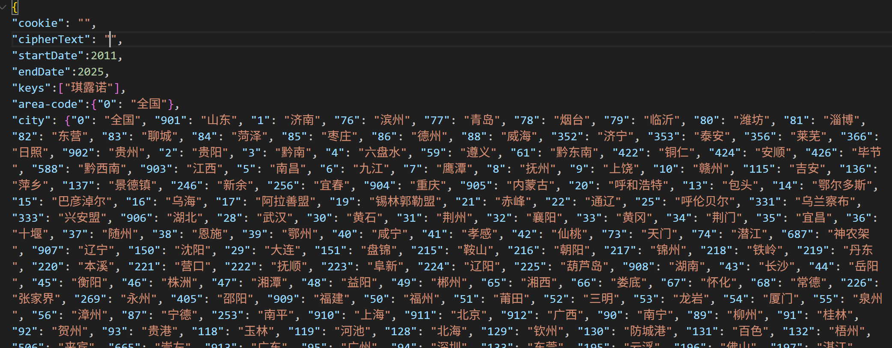
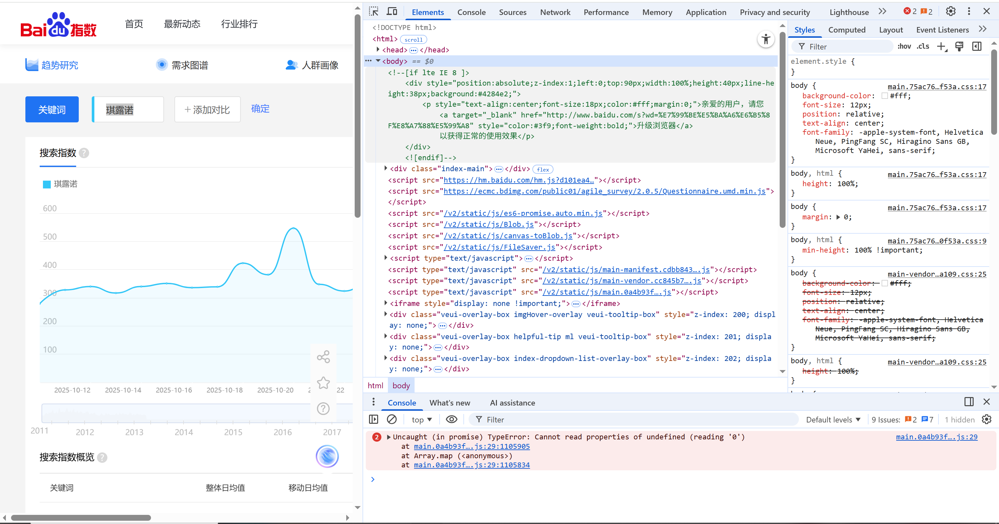
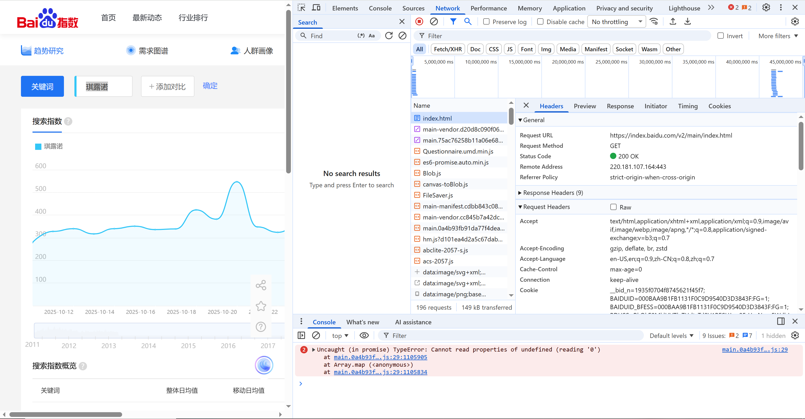
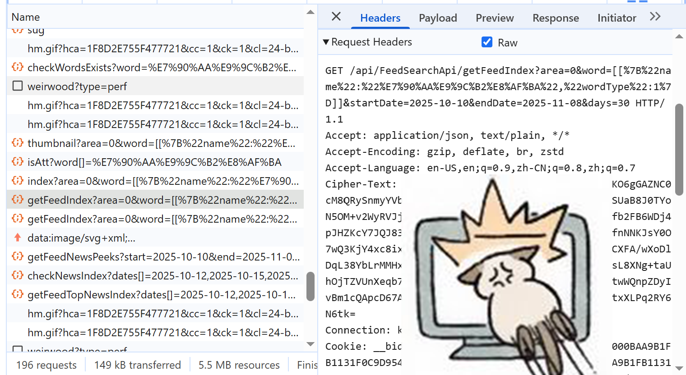
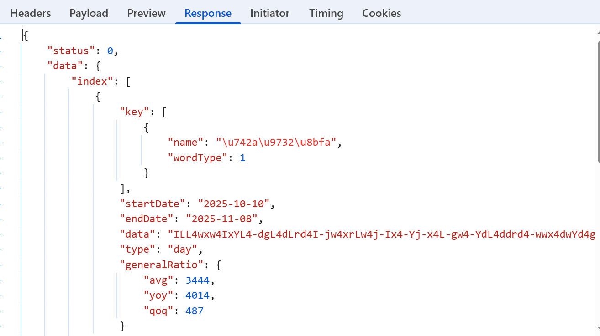
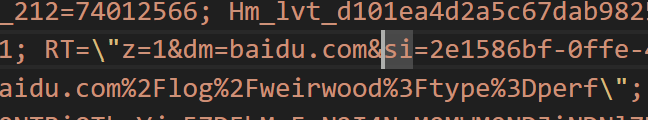

# baidu_index

百度搜索指数爬虫  
参考：  

1. https://github.com/legeling/Baidu_index

2. [GitHub - lun55/baidu_index: 百度搜索指数爬虫](https://github.com/lun55/baidu_index)
   
   

# 运行环境

运行前确保您安装了以下Python库：

requests

json

datetime

openpyxl

# 使用说明

attributes.json 文件里包含了您所需要填写的参数，默认为如下：

cookie和cipherText中包含了您发送请求所需的个人信息。

startDate为请求参数的起始日期，最早的2011。

endDate为请求参数的结束日期，最晚为今年的日期，数据会扒到结束年份前一年的元旦。比如说"endDate":2025，数据最晚会扒到2024/12/31。

Keys为您所需要扒的关键词，需要遵守json格式：["关键词"，“是”，“赤蛮奇”]

area-code为您所需要扒关键词的搜索地区，可以从下面的city中添加，默认只有全国。

    如果要添加北京的话就改成这样：

    {"0": "全国", “911”: “北京”}

# 获取Cookie和cipherText

Cookie和cipherText需要您登录到百度指数的网站中获取。

在网站中按F12打开开发者模式

切换到Network，这里有您浏览器和服务器所有的交互

找到包含request header 包含cipher-text 和cookie 的网络流，然后复制黏贴就好了。这俩都很长，记得打开Raw选项完整显示。

如果出于某些原因API变了，你可以通过response反推cipher-text在哪条网络流里

看起来像这样的response就有cipher-text。

你的cookie里大概率有这样一段带双引号的内容，需要在双引号前打反斜杠 **\\** ，不然json文件会读取失败。

